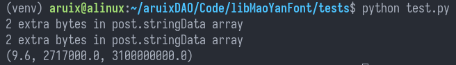

# 猫眼字体识别

该 github repo 在于帮助*xjtlu*的同学们识别猫眼的扭曲字体。已经打包上传至 [pypi](https://pypi.org/project/maoyan-font-recognize) ，可以使用 `pip` 直接安装。

猫眼字体的识别不出来的原理与解决思路[在采茶上](https://m.teaforence.com/teapost/119)

使用方法：

```python
import MaoYanFontRecognize

m = MaoYanFontRecognize.MaoYanFont()
rate, rate_num, money = m.translate(rate_raw, rate_num_raw, font_file, money_raw= -1, money_unit=1)

```

更细致的使用方式请看test。

_**请注意**_，每一个电影的详情页的字体都是猫眼特殊生成的。也就是说，每次刷新之后的字体文件都是不一样的。所以要把每一个详情页中的字体文件同时下载下来，当成参数`font_file`使用。


参数解释：

返回值：

1. `rate`: 猫眼评分
2. `rate_num`: 猫眼评分人数
3. `money`: 票房，元人民币为单位，如果是美元会按照 2021/10/26 日汇率进行计算。
4. `money_unit`: 票房的单位，只有 3 种单位
   1. 万: 1e4,
   2. 亿: 1e8，
   3. 万美元: 63900

输入值：

1. `rate_raw`: 未经处理的猫眼评分，从猫眼上直接爬下来的数据，放进 `bs4` 之后的 `tag` 里的 `contents`，下面代码是实例，以下的几个属性都差不多：

    ```python
    spans = soup("span", class_="stonefont")
    rate_raw = spans[0].contents[0]
    rate_num_raw = spans[1].contents[0]
    money_raw = spans[2].contents[0]
    ```

3. `rate_num_raw`: 未经处理的评分人数，
4. `font_file`: 每一个电影的详情页都会有一个新生成的字体，这个属性需要这个字体文件的`io.BytesIO()`的形式，建议通过网页上的详情把字体下载下来再传进来。
5. `money_raw`: 未经处理的票房, 
6. `money_unit`: 票房单位。


## 测试

测试结果：



输出： `2 extra bytes in post.stringData array`，是TTFont库造成的，不会影响正常使用。


